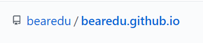

# how-to-get-adsense-on-a-free-github.io-blog
<h3>1. Create a ____.github.io blog</h3>

create a respritory named your username.github.io and make sure you add a README

<h3>2. Create a adsense account</h3>

